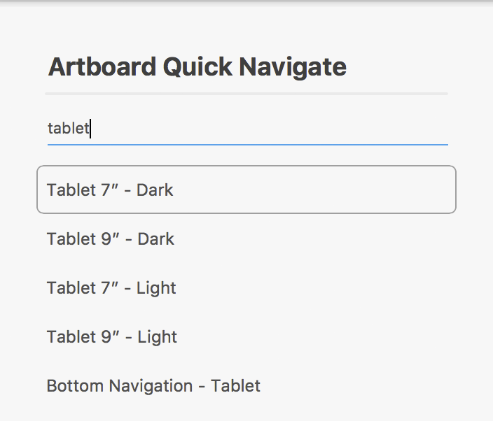

[Adobe XD](https://www.adobe.com/products/xd.html) plugin to quickly jump to a specific artboard.

* Type to search artboards by name
* Press Enter to jump to the top search result
* Use arrow keys to navigate the top 5 matching results
* Press Escape to go back to your previous view

## How to install this plugin

1. Launch XD and go to _Plugins > Discover Plugins_
2. Search for "Artboard Quick Navigate"
3. Click Install

If you have any problems, please report an issue at https://github.com/peterflynn/xd-artboard-quicknav/issues.

## How to fork this plugin

1. Download this repo to your computer
2. **Important:** Change the `id` in manifest.json
3. Launch XD and go to _Plugins > Development > Show Develop Folder_
4. Place this entire repo in a subfolder in this location
5. In XD, run _Plugins > Development > Reload Plugins_ (or quit & relaunch XD)
